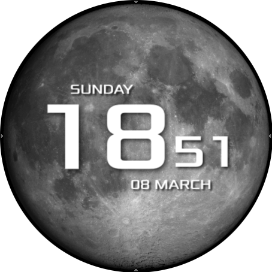

# Lonely Lunar

A live wallpaper. Only for [AsteroidOS](http://asteroidos.org/)



## How to install

Firstly you'll need to clone this repository:
```bash
git clone https://github.com/MagneFire/lonely-lunar.git
cd lonely-lunar
```
Then depending on the USB mode of your watch you can either chose to install using Developer or ADB mode.

To install using Developer mode use the command:
```bash
./push.sh
```

To install using ADB mode use the command:
```bash
./push.sh adb
```

## Credits

Animated lunar libration and phase: https://en.wikipedia.org/wiki/File:Lunar_libration_with_phase_Oct_2007_(continuous_loop).gif
